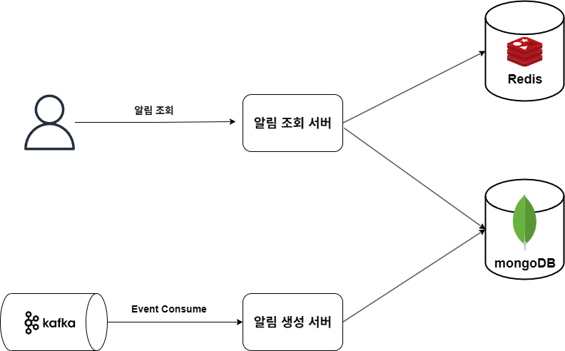

# SNS 알림센터 프로젝트

## ✅ 프로젝트 개요
SNS에서 **알림센터(알림 탭)** 는 사용자가 자신과 관련된 활동이나 이벤트를 확인할 수 있는 핵심 기능입니다.
이 프로젝트에서는 좋아요, 댓글, 팔로우, 멘션 등 다양한 이벤트를 처리하는 **알림 시스템**을 설계하고 구현했습니다.

### 주요 기능
- 👍 좋아요 알림
- 💬 댓글 알림
- 👤 팔로우 알림

### 목적
- 사용자가 **중요한 활동을 놓치지 않도록 지원**
- 관련된 모든 활동을 **한눈에 확인 가능**
- 대규모 트래픽에도 **안정적인 알림 제공**

---

## 🏗️ 최종 아키텍처

## 1️⃣ 초기 구조 (단일 서버)
- 알림 생성과 조회를 **단일 서버**에서 처리
- ✅ 구조 단순
- ❌ 생성 부하가 조회까지 영향을 주어 지연 발생

## 2️⃣ 생성/조회 서버 분리
- **알림 생성 서버**와 **조회 서버**를 분리
- ✅ 독립성 확보
- ❌ 여전히 **강결합 구조** → 장애 전파 가능

## 3️⃣ Kafka 도입 (비동기 처리)
- 리액션/댓글 이벤트 → **Kafka 전송**
- 알림 생성 서버가 **Kafka 구독 후 비동기 처리**
- ✅ 상위 서버와의 결합도 감소
- ✅ 장애 전파 최소화

## 4️⃣ 캐싱 적용 (조회 성능 개선)
- 조회 서버에서 **Redis 캐시 → DB 조회 구조** 적용
- ✅ 자주 조회되는 알림을 캐시에서 빠르게 응답
- ✅ DB 부하 감소
---

# 🗄️ 데이터베이스 선택

### MySQL
- 관계형 DB, ACID 보장
- 정형 데이터 처리에는 적합하지만, 알림과 같은 **비정형/가변 데이터**에는 제약 존재

### MongoDB (최종 선택)
- JSON 문서 기반 **NoSQL**
- 스키마리스 구조로 알림 종류 변화에 유연 대응
- 빠른 쓰기 성능과 **수평 확장성**
- **TTL 인덱스**로 알림 자동 삭제 기능 지원 (예: 90일 보관)

---

# 📦 모듈 구성 전략

### 단일 모듈 멀티 프로젝트
- 각 프로젝트별 독립 구조
- ✅ 단순
- ❌ 공통 코드 중복 및 유지보수 어려움

### 단일 프로젝트 멀티 모듈 (최종 선택)
- `core` 모듈에서 공통 도메인 관리
- ✅ 코드 재사용성, 일관성, 의존성 관리 측면에서 유리
- ❌ 프로젝트 구조가 다소 복잡해질 수 있음

---

# ✅ Spring Cloud Stream 적용
- Kafka와 같은 메시징 시스템을 **추상화**하여 사용
- 브로커 세부 설정에 의존하지 않고, **Function 기반 비즈니스 로직**에 집중
- 이벤트 폭주 시나리오에서도 안정적 메시지 처리 가능

---

# 📢 후기

이번 **SNS 알림센터 프로젝트**를 통해 단순한 알림 기능 구현을 넘어,  
**대규모 서비스 환경에서의 이벤트 처리 아키텍처**를 설계하고 경험할 수 있었습니다.

특히,  

- **Kafka 기반 비동기 구조**를 통해 트래픽 폭주에도 안정적인 알림 처리 가능성을 확인했습니다.  
- **Redis + MongoDB 조합**으로 조회 성능과 데이터 확장성을 동시에 확보했습니다.  
- **Spring Cloud Stream**을 활용하여 메시지 브로커 의존성을 줄이고, 비즈니스 로직 중심의 개발이 가능했습니다.  

단순히 “동작하는 코드”를 넘어,  
**왜 이런 아키텍처를 선택했는지, 어떤 방식으로 확장성과 신뢰성을 확보할 수 있는지**를 깊이 고민할 수 있었던 프로젝트였습니다.  

앞으로는 이 경험을 바탕으로,  
더 복잡한 도메인에서도 **안정적이고 확장 가능한 시스템을 설계할 수 있는 개발자**로 성장하고자 합니다.

